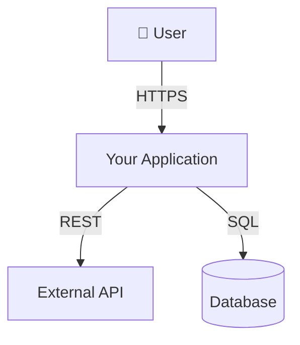
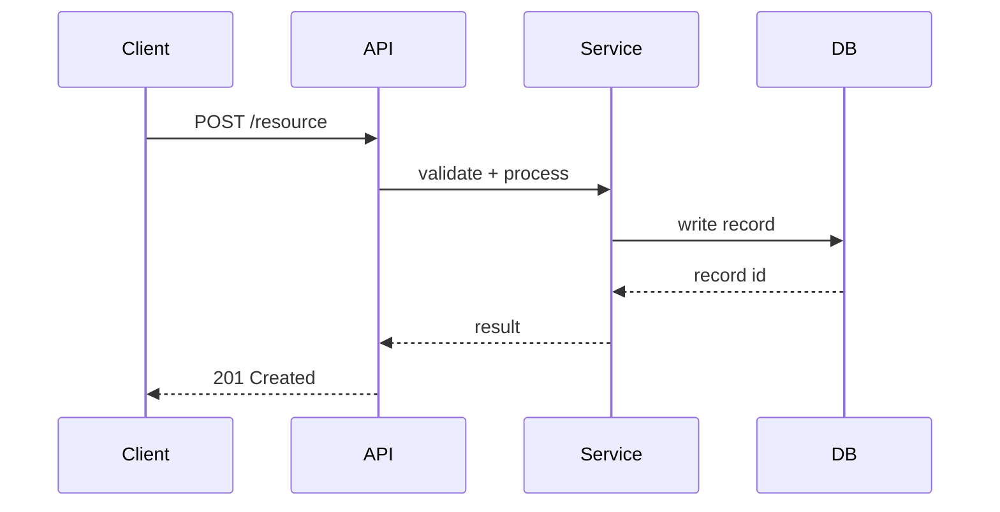

# Architecture: [System or Feature Name]

> Use this template to document system architecture for significant features or subsystems.
> Keep diagrams in this folder alongside the markdown file.
> Filename convention: `<system-slug>.md`

---

## Overview

> One paragraph describing what this system does, its role in the larger product,
> and its primary stakeholders.

---

## System Context

> Show how this system relates to external actors (users, external APIs, other services).
> Use a Mermaid C4 context diagram or a simple block diagram.

---

## Component Breakdown

| Component | Responsibility | Key Files |
|---|---|---|
| `<ComponentA>` | <what it does> | `src/...` |
| `<ComponentB>` | <what it does> | `src/...` |

---

## Data Flow

> Describe the end-to-end flow for the primary use case.

---

## Key Design Decisions

> List the most important decisions made during design.
> For decisions that warrant deeper analysis, create an ADR in `docs/adr/`.

| Decision | Chosen Option | Rationale |
|---|---|---|
| <decision> | <option> | <why> |

---

## Failure Modes & Mitigations

| Failure | Impact | Mitigation |
|---|---|---|
| <DB unreachable> | <requests fail> | <retry with exponential backoff + circuit breaker> |

---

## Open Questions

- [ ] <unresolved question — link to issue if applicable>

---

## References

- [ADR: related decision](../adr/<adr-file>.md)
- [External API docs](<url>)
