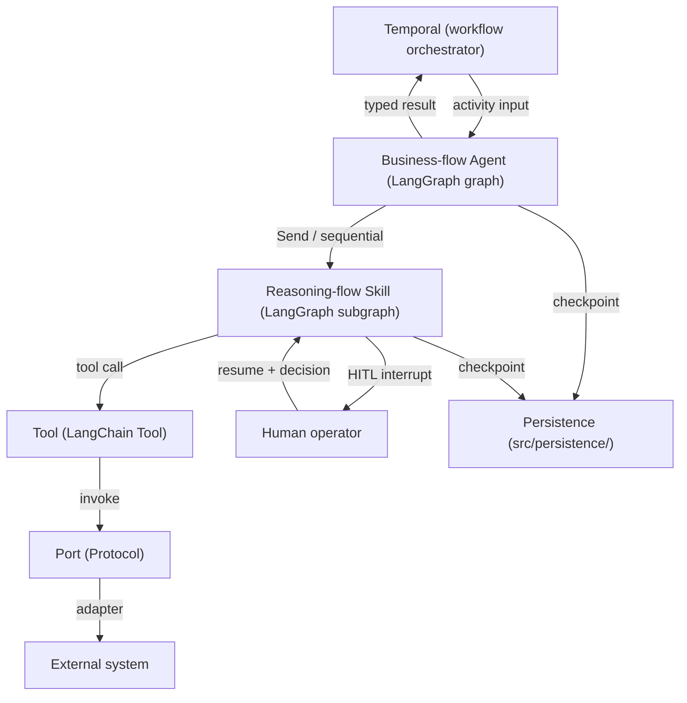

# Agent architecture

**Parent:** [OVERVIEW.md](OVERVIEW.md)

---

## Overview

The agent layer is entirely within LangGraph and sits between Temporal (Tier 1 workflow
orchestrator) and external systems (reached via ports and adapters). It has two levels:
**Business-flow Agents** orchestrate the business flow; **Reasoning-flow Skills** perform
the reasoning work. See [ADR-005](../adr/ADR-005-reasoning-flow-skills.md) for the
composition decision.

---

## System context



---

## Business-flow Agents

Each Business-flow Agent is a compiled LangGraph **graph** mapped to one top-level business
flow. Temporal triggers it as an activity; it returns a typed result.

| Agent | Responsibility |
|---|---|
| **Intake** | Accept and route incoming documents from email and external storage |
| **Response** | Produce a human-reviewed response or outcome for a case |
| **Route to SME** | Determine and assign the appropriate subject-matter expert |
| **Quality Assurance** | Validate case handling quality against defined criteria |
| **Insight** | Aggregate analytics to identify improvements across the whole flow |

A Business-flow Agent does not implement reasoning inline. It selects and sequences the
Skills it needs and tracks their outputs through its own state.

---

## Reasoning-flow Skills

Skills are composable LangGraph **subgraphs** with a defined interface: typed input, typed
output, and declared port dependencies. They live in `src/agents/skills/` and are shared
across Business-flow Agents.

| Skill | Responsibility | Key tools |
|---|---|---|
| **Ingest** | Accept and normalise raw input (documents, payloads) | `EmailTool`, `StorageTool` |
| **Parse & Validate** | Extract structure; check completeness against rules and SOR metadata | `LlmTool`, `SorMetadataTool` |
| **Enrichment** | Call external tools and SORs to add missing or supporting data | `LlmTool`, `SorTool`, `RagTool` |
| **Elicitation** | Interrupt flow and request human input when data is missing or ambiguous | `LlmTool`, `SorMetadataTool` |
| **Q&A** | Answer bounded questions using KB/RAG and case context | `LlmTool`, `RagTool` |
| **Proposal** | Package reasoning output into a structured recommendation for human sign-off | `LlmTool`, `SorTool` |

Skills are not a fixed pipeline. Each Business-flow Agent assembles the subset it needs.

---

## State boundary

Skills always use **skill-local state** — they never read from or write to the parent
graph's state directly. The Business-flow Agent observes skill outputs only through declared
output slots in its own state.

**Sequential skill — typed output mapped to parent state:**

```python
class BusinessFlowState(TypedDict):
    document: Document
    parse_result: ParseResult | None  # populated after Parse & Validate skill completes
```

**Parallel fan-out via `Send` — reducer aggregates results:**

```python
class BusinessFlowState(TypedDict):
    documents: list[Document]
    parsed_results: Annotated[list[ParseResult], operator.add]  # one entry per document

def dispatch_parse(state: BusinessFlowState):
    return [Send("parse_validate", {"document": doc}) for doc in state.documents]
```

The parent graph continues once all `Send` targets complete and the reducer is fully
populated.

---

## Tools

Tools are **LangChain Tool objects** that wrap a port call and expose a `name`, `description`, and `args_schema` to the LLM. They sit between a skill's reasoning nodes and the port layer, enabling the LLM to dynamically select and invoke capabilities rather than calling ports imperatively.

- Tools live in `src/agents/tools/` and are shared across Skills.
- Each Tool wraps exactly one Port method; it accepts and returns domain types from `src/domain/`.
- Skills receive their tools at compose time alongside their ports — the same injection pattern.
- LangSmith traces tool invocations as first-class events (name, inputs, outputs, latency).

```python
# src/agents/tools/llm_tool.py
from langchain_core.tools import tool
from src.domain import LlmRequest, LlmResponse
from src.ports import LlmPort

def build_llm_tool(llm_port: LlmPort):
    @tool
    def llm_invoke(request: LlmRequest) -> LlmResponse:
        """Invoke the LLM with a structured request."""
        return llm_port.invoke(request)
    return llm_invoke
```

---

## Skill interface convention

Every skill exposes a factory function injected with its required tools at compose time:

```python
# src/agents/skills/parse_validate/graph.py
def build_parse_validate_graph(
    llm_tool: LlmTool,
    sor_metadata_tool: SorMetadataTool,
) -> CompiledGraph:
    ...
```

Input and output types are Pydantic domain models from `src/domain/`. Skills never import
from `src/adapters/` — tools (and the ports they wrap) are injected by the composition root.

---

## HITL mechanics

Two HITL patterns operate at different levels of the agent stack:

### In-Skill HITL

Interrupts scoped to a **skill instance** — used when a skill needs human input to continue
reasoning (e.g. missing data, ambiguous input):

1. The Elicitation skill calls `interrupt(ElicitationRequest(...))` — LangGraph pauses that
   skill instance and checkpoints its local state.
2. Temporal receives the interrupt payload, creates a human task, and waits for a signal.
3. The human submits input; Temporal sends a `HumanDecision` signal.
4. Temporal resumes the skill via `graph.invoke(Command(resume=human_decision))`.
5. Other skill instances running in parallel are unaffected.

### In-Agent HITL

Interrupts scoped to the **Business-flow Agent** — used when a human decision is needed at
the agent level before the result is returned to Temporal. Use cases include final sign-off,
mid-flow review, and routing confirmation.

**Placement is unresolved** — see [ADR-006](../adr/ADR-006-in-agent-hitl-placement.md) for
the decision between a Temporal gate (Option A) and an in-agent node (Option B).

All durable state between pause and resume is stored through `src/persistence/`.

---

## Execution chain

```
Temporal Workflow
  └── Business-flow Agent (LangGraph graph)
        ├── [sequential] Skill A → typed output → parent state
        │     └── Tool → Port → Adapter → External system
        ├── [sequential] Skill B → typed output → parent state
        │     └── Tool → Port → Adapter → External system
        └── [parallel via Send] Skill C × N → reducer → parent state
              each instance: local state, isolated checkpoint, scoped HITL
```

---

## Observability

Every agent run tags its LangSmith trace with `case_id`, `workflow_id`, and `step_id`
before any LLM call. See [observability.md](observability.md) for the full audit schema.

---

## Open questions

- [ ] Skill versioning — convention for propagating breaking interface changes to consumers
- [ ] Skill registry — whether `src/agents/skills/` is self-describing or needs a runtime registry

---

## References

- [orchestration.md](orchestration.md)
- [integrations.md](integrations.md)
- [product-and-hitl.md](product-and-hitl.md)
- [persistence.md](persistence.md)
- [observability.md](observability.md)
- [ADR-005](../adr/ADR-005-reasoning-flow-skills.md)
