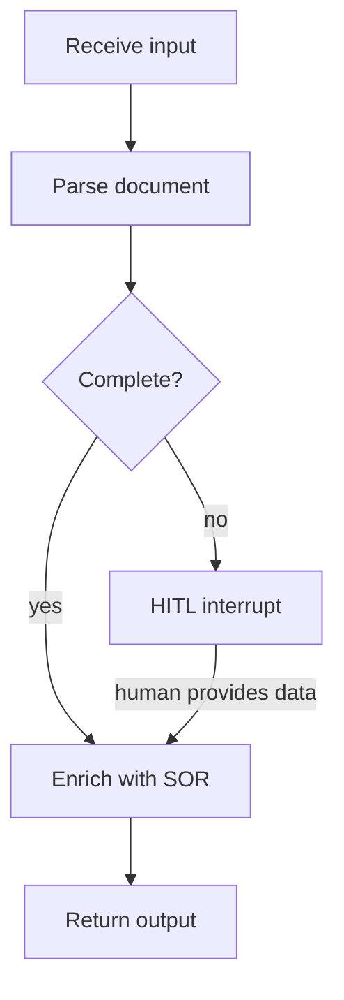

# Spec Templates — Usage Guide

This folder contains spec templates for Skills and their dependencies.
Each template has placeholders (`<like_this>`) to fill in. Remove all placeholder rows and
instructional `>` notes before submitting a spec for review.

---

## Templates

| Template | Use for | Filename convention |
|---|---|---|
| [skill-spec-template.md](skill-spec-template.md) | One Skill | `skills/<skill-slug>-spec.md` |
| [domain-contract-spec-template.md](domain-contract-spec-template.md) | One Pydantic model or group | `domain/<model-name-as-slug>-spec.md` |
| [tool-spec-template.md](tool-spec-template.md) | One LangChain Tool | `tools/<tool-slug>-spec.md` |
| [port-spec-template.md](port-spec-template.md) | One Port Protocol | `ports/<port-slug>-spec.md` |
| [adapter-spec-template.md](adapter-spec-template.md) | One runtime Adapter | `adapters/<adapter-slug>-spec.md` |
| [persistence-spec-template.md](persistence-spec-template.md) | One Skill/Agent checkpoint | `persistence/<slug>-persistence-spec.md` |
| [observability-spec-template.md](observability-spec-template.md) | One Skill/Agent observability | `observability/<slug>-observability-spec.md` |

---

## Examples by template

### domain-contract-spec-template — Validation rules

Examples of validation rules to document:

- Field-level: `confidence` must be in range `[0.0, 1.0]`
- Field-level: `document_id` must match pattern `^DOC-[0-9]+$`
- Cross-field: `resolved_at` must be set if and only if `status == "resolved"`
- Cross-field: `items` must be non-empty when `type == "batch"`
- Immutability: model is frozen (`model_config = ConfigDict(frozen=True)`)

### domain-contract-spec-template — Serialization notes

Serialization notes cover requirements that affect how a model is written to or read from
external systems: audit logs, REST API responses, persistence stores, or inter-service payloads.
Leave blank if the model is internal-only with no special requirements.

Examples:

- Stable field names: `decision` must never be renamed — it is referenced in audit log queries
- Alias: field is exposed as `caseId` in JSON but stored as `case_id` internally (`Field(alias="caseId")`)
- Exclusion: `raw_payload` must be excluded from audit serialization (`exclude` in `model_dump`)
- Format: `created_at` must serialize as ISO 8601 UTC string
- Schema version: model carries a `schema_version` field for forward-compatibility with stored records

### port-spec-template — Protocol definition

```python
# src/ports/<module>.py
from typing import Protocol
from src.domain import <InputType>, <OutputType>, <DomainError>

class <PortName>(Protocol):
    def <method_name>(self, input: <InputType>) -> <OutputType>:
        """<domain-intent description — no vendor details>"""
        ...
```

Example — `LlmPort`:

```python
# src/ports/llm.py
from typing import Protocol
from src.domain import LlmRequest, LlmResponse, LlmError

class LlmPort(Protocol):
    def invoke(self, request: LlmRequest) -> LlmResponse:
        """Generate a completion for the given request."""
        ...
```

### port-spec-template — Fake

A Fake is a working in-memory implementation of the Port Protocol. It:
- stores calls so tests can assert on them,
- returns a configurable response by default,
- supports an optional `raise_error` mode to simulate domain error paths.

```python
# tests/fakes/fake_llm.py
from src.domain import LlmRequest, LlmResponse, LlmError

class FakeLlmPort:
    def __init__(
        self,
        response: LlmResponse,
        raise_error: LlmError | None = None,
    ) -> None:
        self._response = response
        self._raise_error = raise_error
        self.calls: list[LlmRequest] = []

    def invoke(self, request: LlmRequest) -> LlmResponse:
        self.calls.append(request)
        if self._raise_error:
            raise self._raise_error
        return self._response
```

**Happy-path test:**

```python
def test_skill_returns_parsed_result():
    fake_llm = FakeLlmPort(response=LlmResponse(text="parsed"))
    skill = build_parse_validate_graph(llm_tool=build_llm_tool(fake_llm))

    result = skill.invoke(ParseInput(document=sample_doc))

    assert result.status == "complete"
    assert len(fake_llm.calls) == 1          # assert the skill called the tool exactly once
```

**Error-path test:**

```python
def test_skill_surfaces_llm_error():
    fake_llm = FakeLlmPort(
        response=LlmResponse(text=""),
        raise_error=LlmError(message="upstream timeout"),
    )
    skill = build_parse_validate_graph(llm_tool=build_llm_tool(fake_llm))

    with pytest.raises(LlmError):
        skill.invoke(ParseInput(document=sample_doc))
```

### tool-spec-template — Port dependency

Example — `LlmTool` wrapping `LlmPort`:

| Port | Method called | Location |
|---|---|---|
| `LlmPort` | `invoke` | `src/ports/llm.py` |

Example — `SorTool` wrapping `SorPort` with multiple methods:

| Port | Method called | Location |
|---|---|---|
| `SorPort` | `get_case` | `src/ports/sor.py` |
| `SorPort` | `update_case` | `src/ports/sor.py` |

### tool-spec-template — Implementation sketch

```python
# src/agents/tools/<tool_slug>.py
from langchain_core.tools import tool
from src.domain import <InputType>, <OutputType>
from src.ports import <PortName>

def build_<tool_name>_tool(port: <PortName>):
    @tool
    def <tool_name>(input: <InputType>) -> <OutputType>:
        """<description — same as above>"""
        return port.<method_name>(input)
    return <tool_name>
```

### tool-spec-template — Adapter injection

The Tool's code is typed against the Port (Protocol). The composition root decides which
concrete implementation to inject — an Adapter at runtime, a Fake in tests. The Tool never
imports from `src/adapters/` directly.

**Tool definition — typed against Port:**

```python
# src/agents/tools/llm_tool.py
from src.ports.llm import LlmPort          # Protocol only
from src.domain import LlmRequest, LlmResponse

def build_llm_tool(llm_port: LlmPort):     # type annotation = Port (Protocol)
    @tool
    def llm_invoke(request: LlmRequest) -> LlmResponse:
        """Invoke the LLM with a structured request."""
        return llm_port.invoke(request)
    return llm_invoke
```

**Runtime — composition root injects the real Adapter:**

```python
# src/composition_root.py
from src.adapters.ai_gateway.llm import AiGatewayLlmAdapter  # concrete Adapter
from src.agents.tools.llm_tool import build_llm_tool

llm_tool = build_llm_tool(AiGatewayLlmAdapter(config))      # Adapter satisfies LlmPort structurally
```

**Tests — composition root injects the Fake:**

```python
# tests/skills/test_parse_validate.py
from tests.fakes.fake_llm import FakeLlmPort
from src.agents.tools.llm_tool import build_llm_tool

llm_tool = build_llm_tool(FakeLlmPort(response=LlmResponse(...)))  # Fake satisfies LlmPort
```

The Tool, Skill, and Adapter are all unaware of which backing is active — only the composition
root knows.

---

### adapter-spec-template — Adapter implementation and injection

An Adapter satisfies a Port Protocol through structural typing — no subclassing required (P4).
It translates domain calls into vendor SDK calls and converts any vendor errors into domain
errors before surfacing them (P6). It never retries.

**Adapter definition — implements Port structurally:**

```python
# src/adapters/ai_gateway/llm.py
from src.ports.llm import LlmPort          # imported for type-checking only, not subclassed
from src.domain import LlmRequest, LlmResponse, LlmError
from ai_gateway_sdk import AiGatewayClient, AiGatewayError

class AiGatewayLlmAdapter:                 # no explicit `(LlmPort)` inheritance needed
    def __init__(self, client: AiGatewayClient) -> None:
        self._client = client

    def invoke(self, request: LlmRequest) -> LlmResponse:
        try:
            raw = self._client.complete(prompt=request.prompt, model=request.model)
        except AiGatewayError as e:
            raise LlmError(message=str(e)) from e   # P6: vendor error → domain error
        return LlmResponse(text=raw.text, tokens_used=raw.usage.total)
```

**Composition root — wires Adapter into Tool:**

```python
# src/composition_root.py
from ai_gateway_sdk import AiGatewayClient
from src.adapters.ai_gateway.llm import AiGatewayLlmAdapter
from src.agents.tools.llm_tool import build_llm_tool

client = AiGatewayClient(base_url=config.ai_gateway_url, token=config.ai_gateway_token)
adapter = AiGatewayLlmAdapter(client)      # Adapter owns all vendor-specific config
llm_tool = build_llm_tool(adapter)         # Tool receives the Adapter typed as LlmPort
```

The Adapter is the only place where vendor SDK types appear. Everything above it (Tool, Skill,
Skill graph) sees only domain types and Port Protocols.

---

### skill-spec-template — Internal flow diagram

Example Mermaid diagram for a Skill's internal flow:



### observability-spec-template — Structured log events

Default log events emitted by every Skill (replace `<name>` with the skill slug):

| Event | Level | Fields | Trigger |
|---|---|---|---|
| `skill.<name>.started` | INFO | `case_id`, `workflow_id`, `step_id` | Skill entry |
| `skill.<name>.completed` | INFO | `case_id`, `duration_ms` | Skill exit |
| `skill.<name>.failed` | ERROR | `case_id`, `error_type`, `message` | Unhandled domain error |
| `skill.<name>.hitl_interrupt` | INFO | `case_id`, `elicitation_request_id` | HITL pause |
| `skill.<name>.hitl_resumed` | INFO | `case_id`, `human_actor`, `decision` | HITL resume |

### observability-spec-template — Audit records

Default audit records for every Skill:

| Tier | Event | What to capture |
|---|---|---|
| LLM | LLM invocation | Model id, token usage, latency; prompt/response per retention policy |
| HITL | Human decision | Proposal payload hash, human actor, decision, timestamp |
